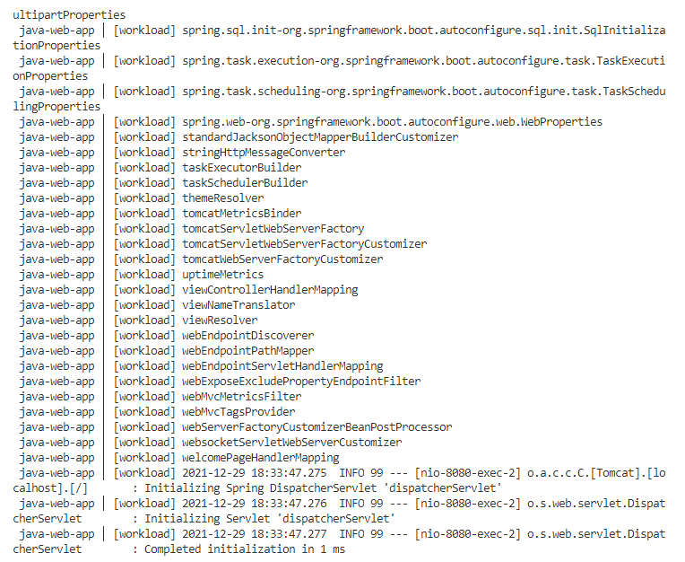

The accelerator contains a template for creating a cloud-native application that is compliant with Alana's enterprise governance standards, and the workload.yaml file for interfacing with Tanzu Application Platform. Cody does not need to provide any other configuration files, such as Dockerfiles or Kubernetes resources, that have dependencies on the target application infrastructure.

The workflow here is that Cody downloads the accelerator template to his local machine, customizes to his needs, and then publishes it to a Git Repo where we can hand off to Alana.


For this demo, we'll use the Tanzu command line interface instead of the Web UI to download the java-web-app application accelerator. The Tanzu CLI is your one-stop shop for interacting with the Tanzu Application Platform.

```execute
tanzu accelerator generate java-web-app --server-url https://accelerator.{{ ingress_domain }} --options='{"gitUrl": "'"$GITREPO"'","gitBranch":"main","ociCodeRepo":"'"$CODE_OCI_TARGET"'"}'
```

Unzip the repo into your local file system:

```execute
unzip -o java-web-app.zip && shopt -s dotglob
```

Now lets take a look at the code in our VSCode editor:
  
Lets see the only kubernetes YAML that will be needed for this app which itself was fully built and updated with the required values by app accelerator:
```editor:open-file
file: java-web-app/tap/workload.yaml
```  
  
In the workload yaml that was generated from the accelerator we can see that it is pointing to a Git repo we still havent created.

Lets now take a look at our simple java web app code:
```editor:open-file
file: java-web-app/src/main/java/com/example/springboot/HelloController.java
```  
  
As we can see this is a very simple app that will print out **Greetings from Spring Boot + Tanzu!**

Tilt is an industry standard for development against Kubernetes environments and TAP has a very strong integration with Tilt. Tilt is configured per project via a simple config file called **Tiltfile** at the root of your project.

Lets see what this Tilt file looks like:
```editor:open-file
file: java-web-app/Tiltfile
``` 
  
Lets deploy this app from our local source code using the Tanzu Plugin for VSCode and Tilt, and then we will start to iterate over it before pushing our code to git.  
```editor:execute-command
command: tanzu.liveUpdateStart
```
  
This will begin to build a container image for our application and then deploy it to our cluster. As this is the first run in can take around 5 minutes to complete.  
You will know it has completed when you see the output of the app itself running in the condole simillar to the bellow: 
  

Tilt automatically configures port forwarding for our app to our localhost at port 8080!!!  
Now lets check out our app:  
```execute-2
curl http://localhost:8080
```
And we can see that our pod is running as well:
```execute
kubectl get pods
```  
  
Now lets Look at the code we want to change:
```editor:select-matching-text
file: java-web-app/src/main/java/com/example/springboot/HelloController.java
text: "Greetings from Spring Boot + Tanzu!"
```

We've selected the code that prints our message to the UI. Click below to update the message for our app.

```editor:replace-text-selection
file: java-web-app/src/main/java/com/example/springboot/HelloController.java
text: "Greetings %session_namespace% From Tanzu Application Platform"
```  

As we can see, logs ran for a few seconds at the bottom of our screen. Lets check out our app now:
```execute-2
curl http://localhost:8080
```  
  
As we can see the app is Live Updated and our code changes are made immediately on our running Pod in the remote cluster!!!!!!
  
Lets now stop our live update session:

```editor:execute-command
command: tanzu.liveUpdateStop
```
  
Our final step is to clean up the environment so we can move on to the next steps of deploying our app via GitOps:
```execute
tanzu apps workload delete java-web-app -y
```
